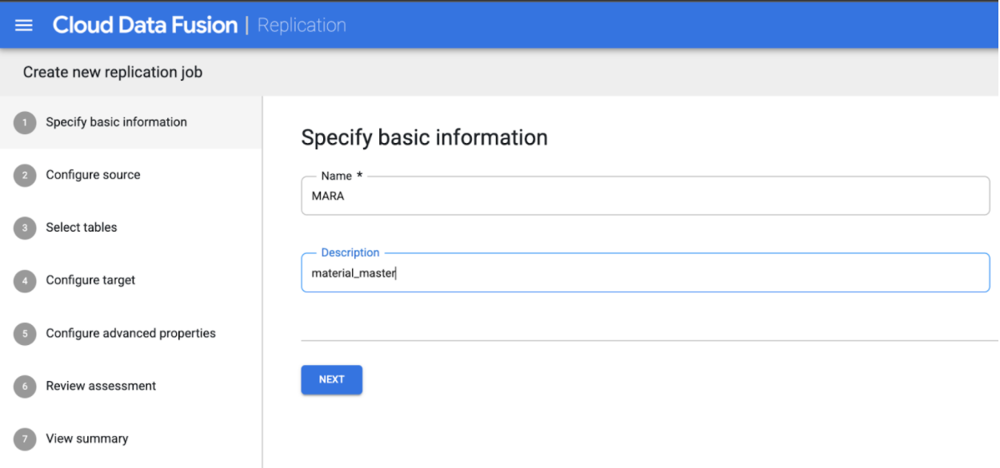

## The following pipelines are tested with CDF version 6.5.1 and SLT plugin 0.7.0 .

## Create and deploy a Replication job in CDF

1. Go to the CDF instance and click on the Replicate.

2. Select Create a Replication Job. 

 

3. Enter a unique Name and Description for the Replication Job. Click on Next

4. Select the source SAP Landscape Transformation (SLT)

 

5. Configure the source by entering values in the following fields:
- **PROJECT ID**: The ID of your Google Cloud project (this field is pre-populated)
- **Data replication GCS Path**: The Cloud Storage path that contains data for replication. It must be the same path that is configured in the SAP SLT jobs. Internally, the provided path will be concatenated with Mass Transfer ID and Source Table Name:
  Format: gs://<base-path>/<mass-transfer-id>/<source-table-name>
  Example: gs://slt\_bucket/01C/MARA
- **GUID**: The SLT GUID—a unique identifier assigned to SAP SLT Mass Transfer ID.
- **Mass Transfer ID**: The SLT Mass Transfer ID—a unique identifier assigned to the configuration in SAP SLT.
- **SAP JCo Library GCS Path**: The storage path that contains the user-uploaded SAP JCo library files. SAP JCo libraries can be downloaded from SAP Support Portal.
  - **SLT Server Host**: SLT Server hostname or IP address.
- **SAP System Number**: Installation system number provided by the system administrator.
- **SAP Client**: The SAP client to use (for example, 100).
- **SAP Language**: SAP logon language (for example, EN).
- **SAP Logon Username**: SAP username.
  - Recommended: If the SAP Logon Username changes periodically, use a macro.
- **SAP Logon Password (M)**: SAP User password for user authentication.
  - Recommended: Use secure macros for sensitive values, such as passwords.
- **Stop SLT replication when CDF job stops**: Attempts to stop the SLT Replication job (for the tables involved) when the Cloud Data Fusion Replication job stops. Might fail if the job in Cloud Data Fusion unexpectedly aborts.
- **Service Account Key**: The key to use when interacting with Cloud Storage. The service account must have permission to write to Cloud Storage. When running on a Google Cloud VM, this can be set to 'auto-detect', which uses the service account key on the VM.
6. On the **Select tables** step, a list of tables selected for replication in the SLT system appear. Select the tables to replicate and click **Next**.

7. SLT Source screen entries.

8. Click on Next.

9. Now it fetches a list of all tables which are processed in the LTRC transaction code. Select the MARA table.

10. Click on Next.

11. Select Target BigQuery.

12. Below are the details you need to provide in the target.

13. Click on Next.
14. Configuration advance properties need to change. If you know the expected number of data replication tasks in an hour, you can select the appropriate option. If not, leave it as default.

15. Click on Next.

16. Review the assessment.

17. Click on Next.

18. Final Review all the information which has been entered.

19. Click on the Deploy Replication Job Button.

20. Once it is deployed, you will see the below screen.

21. Click on Configuration and select the compute engine.

22. Click Save

23. Click on Start to start the Replication job.

 

24. To monitor the job status, check the Replication job logs. The Replication job fetches the selected source table Replication job status from SAP at an interval of 5 minutes.

Copyright 2021 Google Inc. All rights reserved.
The use of this software is governed by the Pre-GA Offering Terms section of the the Service Specific Terms set forth at https://cloud.google.com/terms/service-terms#general-service-terms
